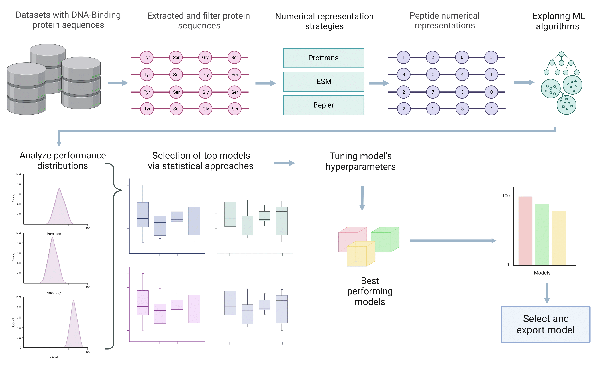

# Hydrophobin and Cerato-platanin of Paradendryphiella salina: In Silico Prediction, Characterization, Proteomic Assessment, and qPCR validation

This repository contains the source files and supplementary information for the implementations and explored machine learning methods presented in this work

## Abstract

Hydrophobins and cerato-platanins, hydrophobic and surface-active extracellular proteins produced by filamentous fungi, were investigated in the marine fungus Paradendryphiella salina for the first time. This study identified and characterized two hydrophobin genes (PsHYD1 and PsHYD2) and one cerato-platanin gene (PsCP) within the complete genome sequence of this fungus. In our comprehensive analysis, we evaluated the physicochemical properties of these proteins from P. salina, revealing PsCP as the heaviest (12.70 kDa) followed by PsHYD 2 (6.62 kDa) and PsHYD 1 (5.98 kDa). All proteins demonstrated isoelectric points below 7, with PsHYD 1 and PsHYD 2 exhibiting identical positive GRAVY scores (0.462), indicating hydrophobicity, whereas PsCP showed a negative GRAVY score (-0.202), suggesting hydrophilicity. Stability indices for all proteins were below 40, signaling in-solution stability. The proteomic assessment using Mass spectrometry identified 2,922 proteins, including cerato-platanin but not hydrophobin, underscoring a potential regulatory, environmental or technological impact on gene expression, secretion or purification protein. qPCR analysis under various growth conditions showed differential gene expression, affected by development stages and evaluated substrates (sucrose, alginate, seaweed), with PsHYD1 being the most expressed. Our findings suggest the potential of P. salina to evolutionary adaptation to marine ecosystems, possibly featuring fewer hydrophobin genes than its halophilic and terrestrial counterparts, yet highlighting its capacity to produce surface-active proteins utilizing seaweed carbohydrates. These proteins hold biotechnological promise, with applications extending from medical bio-coatings for various materials to food industry uses, such as foam stabilizers, and environmental applications in bioremediation.

## Repository description

This repository contains:
- raw_data: All raw data collected from the Uniprot database to train the predictive models.
- src: The source code implemented in this work.
- results: The trained models developed in this work.

## Requeriments

Specific versions of requirements are listed in:
- [requirements.txt](requirements.txt)

A full detail environment config document is exposed in:
- [environment.yml](environment.yml)

## Developing classification models

For training a predictive model using machine learning algorithm we have implemented the pipeline described in the following figure:

